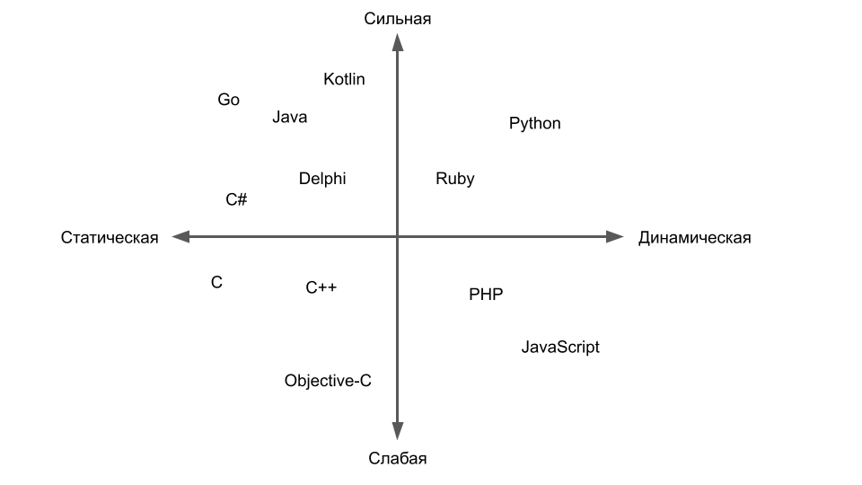

# Курс Python 2021 Mediasoft
## 1. Переменные и типы данных

### Конспект:
[main.py](./main.py)

### Переменные и типы данных:
[Ликбез по типизации в языках программирования @Хабр](https://habr.com/ru/post/161205/)

### Компас типизиции:

### Отдельно про форматирование строк можно почитать:
- [Python String Formatting Best Practices](https://realpython.com/python-string-formatting)
- [Common string operations: Format String Syntax](https://docs.python.org/3/library/string.html#format-string-syntax)

### Иерархия типов в Python:
- [Data model: The standard type hierarchy](https://docs.python.org/3/reference/datamodel.html#the-standard-type-hierarchy)